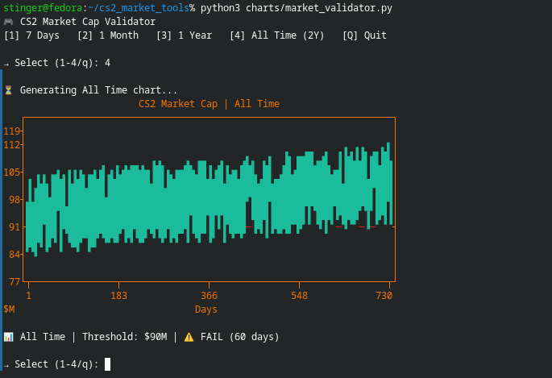

# 🎮 CS2 Market Cap Validator

Terminal-based market health validation for CS2 — no browser, no GUI.



*(Works in any terminal — here's the ASCII version for docs/CLI lovers)*

### ▶️ Run It
```bash
python3 charts/market_validator.py


🎮 CS2 Market Cap Validator
[1] 7 Days   [2] 1 Month   [3] 1 Year   [4] All Time (2Y)   [Q] Quit

→ Select (1-4/q): 


CS2 Market Cap | 7 Days                                      
     ┌──────────────────────────────────────────────────────┐
125.0┤                                                      •│
     │                                                  •••• │
     │                                              ••••     │
     │                                          ••••         │
     │                                      ••••             │
     │                                   •••                 │
117.5┤                                •••                    │
     │                             •••                       │
     │                          •••                          │
     │                      ••••                             │
     ├──••──────────────••••───••────────────────────────────┤
     │•••                •••                                  │
110.0┤                   ••                                    │
     │                •••                                     │
     │             •••                                        │
     │          •••                                           │
     │       •••                                              │
     │    •••                                                 │
     │••••                                                    │
102.5┤                                                         │
     └┬───────────────────┬───────────────────┬────────────────┬┘
     1.0                2.8                4.5              7.0

📊 7 Days   | Threshold: $105.0M | ✅ PASS


pip install plotext rich
git clone https://github.com/aymanaghi/cs2-market-tools.git
cd cs2-market-tools
python3 charts/market_validator.py


→ `Ctrl+O` → `Enter` → `Ctrl+X`

---

#### 3. **Finalize & Push**

```bash
# Add everything
git add charts/market_validator.py README.md charts/demo_7d.png

# Commit
git commit -m "✨ Add market cap validator with terminal chart demo"

# Push to GitHub
git push origin main
